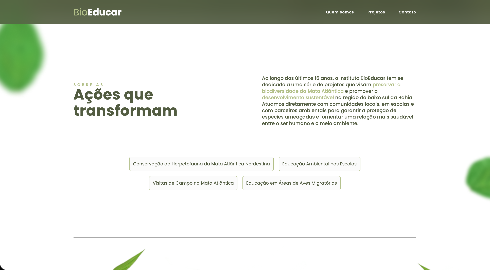

# 🌱 BioEducar — Site Institucional

Este repositório contém o desenvolvimento do site institucional da **BioEducar**, uma associação voltada à educação e impacto socioambiental.

O projeto foi desenvolvido com foco em performance, experiência do usuário e fluidez visual, com o objetivo de criar um site atrativo para os usuários.

---

## 💻 Telas

  
  

---

## 🚀 Tecnologias Utilizadas

### 🔙 Back-end

* **Django** — gerenciamento de rotas, estrutura do projeto e renderização das páginas

### 🎨 Front-end

* **HTML5**
* **CSS3**
* **JavaScript**

### ✨ Animações e Experiência

* **GSAP (GreenSock Animation Platform)** — animações avançadas e transições suaves entre seções

---

## 📌 Status do Projeto

✅ Projeto finalizado
🚀 Disponível para melhorias e expansão futura

---

## 👨‍💻 Autor

Desenvolvido por **José Henrique**

* Designer & Desenvolvedor Web

---

## 💡 Observação

Este projeto foi desenvolvido como parte de um trabalho freelancer em conjunto ao IFBA (Instituto Federal de Educação, Ciência e Tecnologia da Bahia), envolvendo desde o design da interface até a implementação completa da aplicação web.
